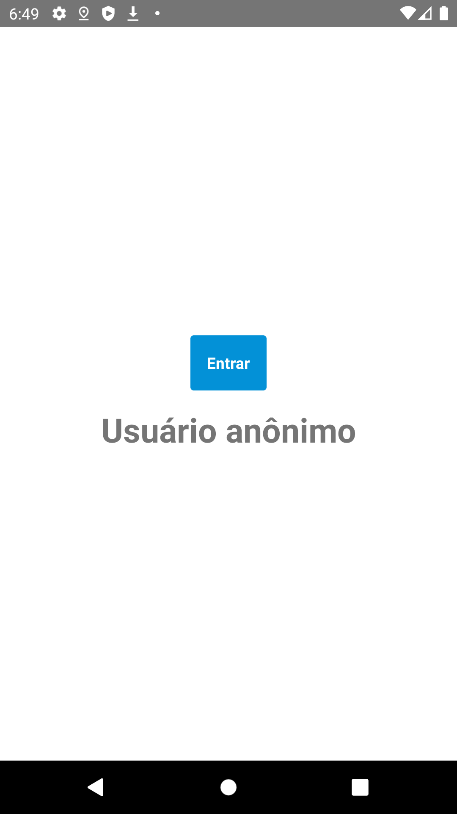
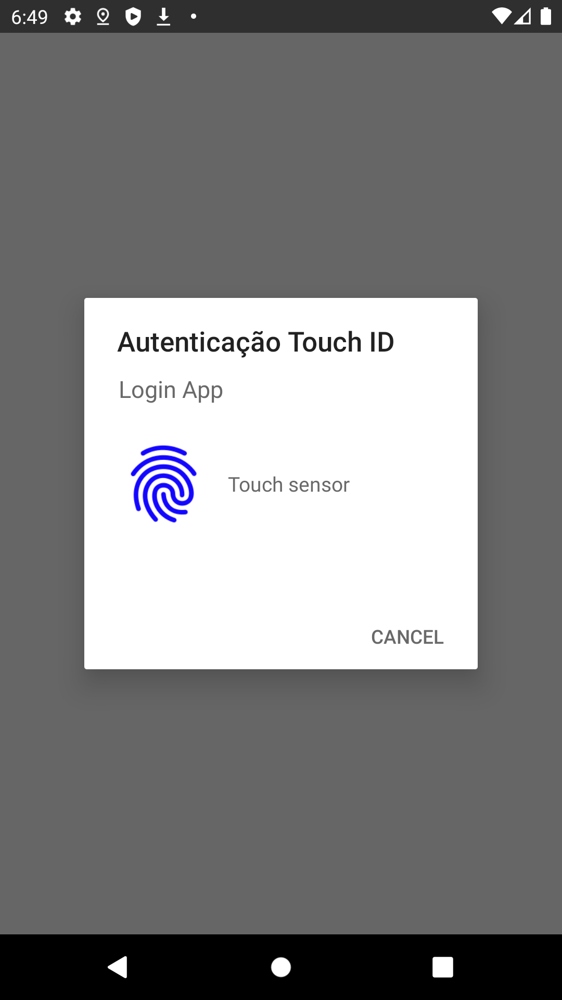
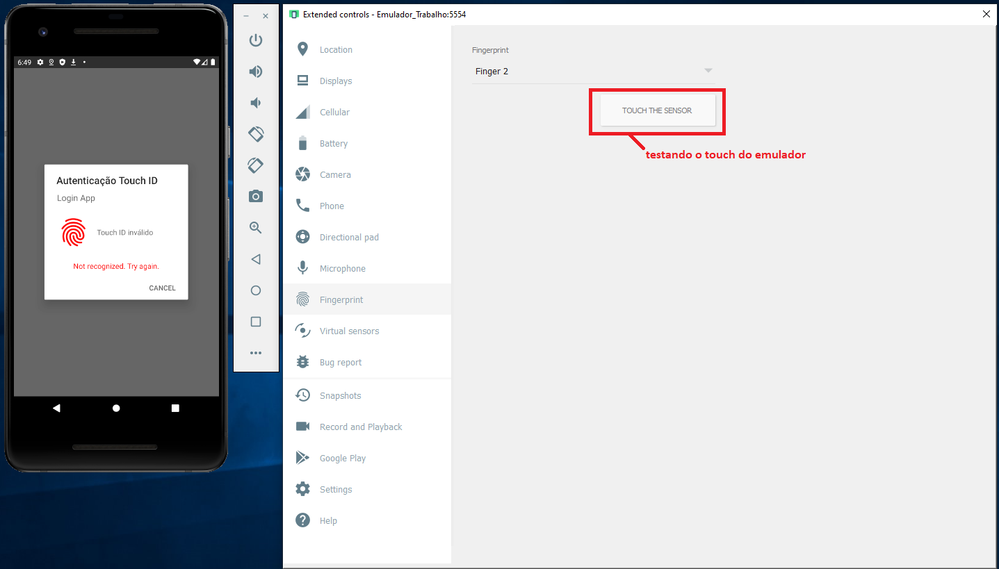
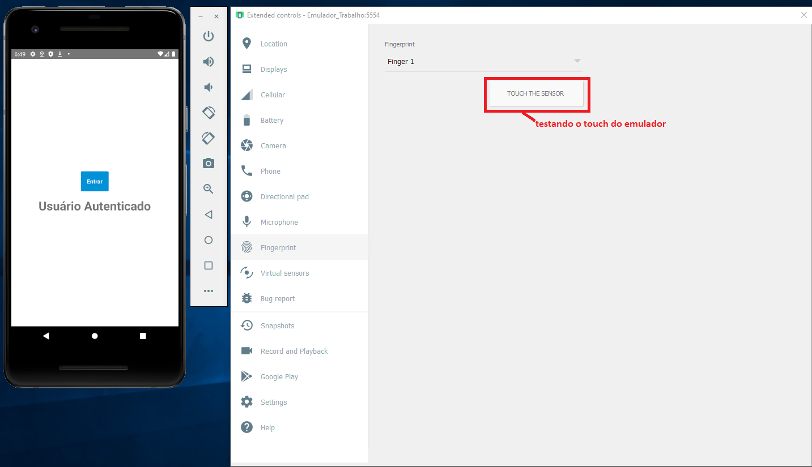

# touchid-example
Projeto de testes criado com o objetivo de testar a bilbioteca React Native Touch ID

### Bibliotecas utilizadas
• react-native-touch-id

### Para testar

### mobile
react-native run-android

### screenshots

